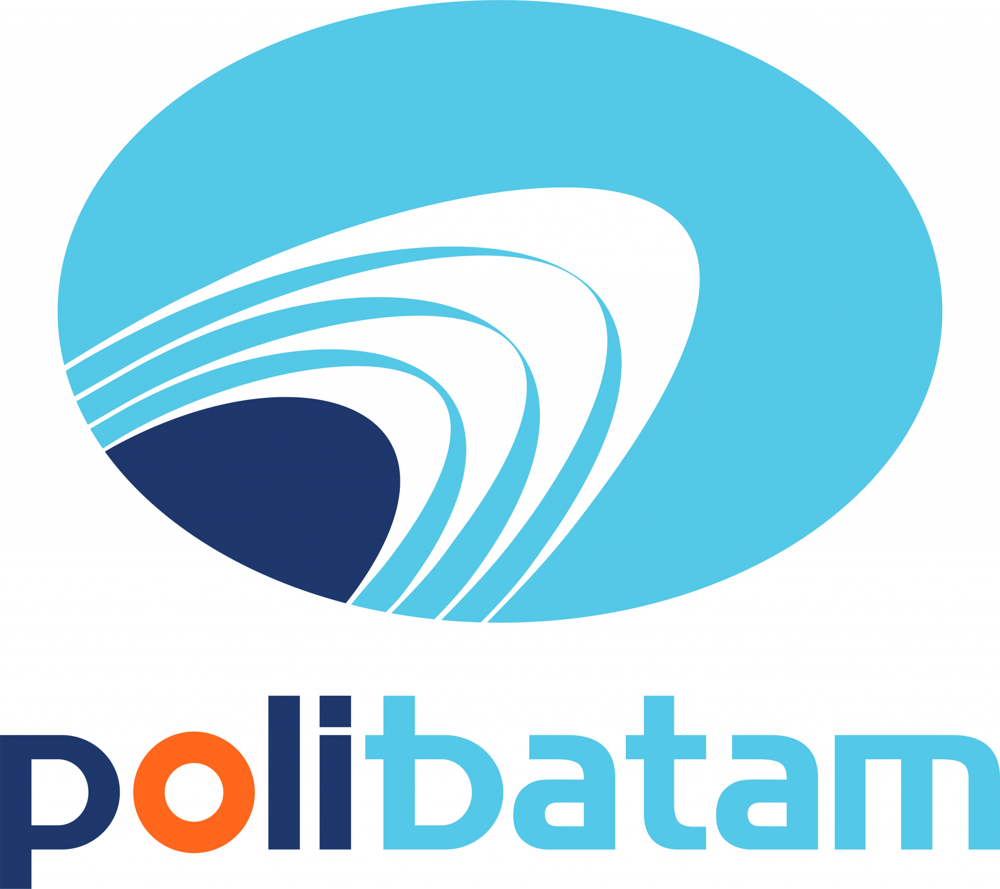

  

<h1 align="center">Politeknik Negeri Batam</h1>

## 🍰 Cake & Brownies Logo

CMS Website For Cake & Brownies **"Manies.Cakery"**

---

## 📄 Project Best Learning Kelompok 3

| NIM        | Nama Lengkap          | Role                | Posisi       |
|------------|------------------------|---------------------|--------------|
| 3312411001 | Dea Asnuari            | Frontend & Backend  | Ketua Tim    |
| 3312411004 | Hamdan Azmi            | Frontend & Backend  | Anggota Tim  |
| 3312411008 | Christian Marcelino    | Frontend & Backend  | Anggota Tim  |
| 3312411031 | Fatra Syahreza         | Frontend & Backend  | Anggota Tim  |

---

## 🔧 Fitur yang Tersedia
- Dashboard  
- Catalog  
- About Us  
   

## 📦 Manajemen Produk
- Daftar produk  
- Detail produk  
- Kategori produk  
- CRUD produk untuk admin  

## 🧑‍💼 Manajemen Admin
- Dashboard admin  
- Manajemen user & produk  

## 🧭 Navigasi & UI
- Navbar responsif (desktop & mobile)   
- Tombol WhatsApp langsung ke admin  
- Footer dengan informasi kontak  

## 📄 Halaman
- Home  
- Products  
- About    
- Admin Dashboard  

## 📱 Responsivitas
- Tampilan mobile-friendly  
- Menu mobile  
- Layout yang responsif  

## 🔗 Integrasi
- WhatsApp API  
 

## 🎨 Styling & UI/UX
- Desain modern dengan Tailwind CSS  
- Animasi & transisi  
- Font Awesome icons  
- Google Fonts (Poppins & Pacifico)  

## 🔒 Keamanan
- Middleware untuk autentikasi & admin  
- CSRF protection  
- Validasi form  

## 🗄️ Database
- MySQL / MariaDB  
- Eloquent ORM (Laravel)  

## 🛠️ Teknologi yang Digunakan

| Kategori        | Teknologi                                                                 |
|-----------------|---------------------------------------------------------------------------|
| Backend         | PHP (Laravel Framework), MySQL/MariaDB                                   |
| Frontend        | HTML, CSS (Tailwind CSS), JavaScript, Blade Template                     |
| Styling & UI    | Tailwind CSS, Font Awesome, Google Fonts (Poppins, Pacifico)             |
| Dependency Tools| Composer (PHP), npm (Node.js modules)                                    |

---

## 🚀 Catatan Pengembangan

Proyek CMS Manies.Cakery saat ini berada dalam tahap pengembangan aktif.
Kami berfokus pada peningkatan fitur, penyempurnaan tampilan antarmuka, dan optimalisasi pengalaman pengguna. 
Kami berkomitmen untuk terus menyempurnakan sistem ini agar lebih bermanfaat, terutama bagi pelaku UMKM seperti Manies.Cakery.
Update terbaru akan terus kami rilis secara berkala.

---

## 📌 Lisensi
- Proyek ini dibuat untuk tujuan pembelajaran dalam kegiatan Project Based Learning dan bukan untuk penggunaan komersial.  
- Semua hak cipta milik Kelompok 3 – Informatika 2A Malam, Polibatam.
